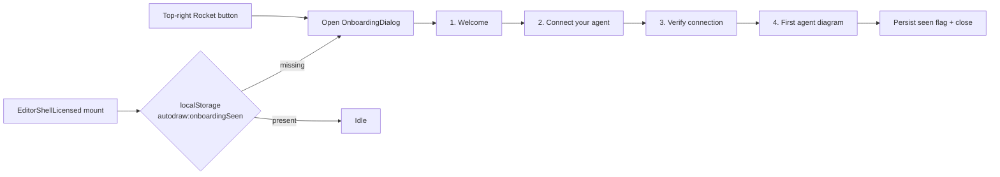

## Design

Visual + structural reference now comes directly from the [blocks.so](https://blocks.so) registry (MIT, ephraimduncan/blocks). We pull two blocks via the official `shadcn` CLI rather than re-implementing them:

- [`@blocks-so/onboarding-03` — "Onboarding Steps with Progress"](https://blocks.so/onboarding/onboarding-03) → step rail rendered in the dialog body.
- [`@blocks-so/dialog-11` — "Multi-Step Wizard"](https://blocks.so/dialogs/dialog-11) → outer dialog shell (header / body / Separator / footer with Back / Skip / Next).

Both blocks slot into the editor's existing shadcn-style `apps/editor/src/components/ui/` primitives (button, dialog, label, tabs, separator, dropdown-menu), so importing them just adds the new `progress` primitive and the two block files. Adapted (renamed, copy swapped, wired to our state) into the editor — see [Component reuse](#component-reuse) below.

Flow:



## Component reuse

### Registry config

The editor doesn't yet have a `components.json` (only `apps/app` does). Add one tailored to the editor's existing setup:

```json
{
  "$schema": "https://ui.shadcn.com/schema.json",
  "style": "new-york",
  "rsc": false,
  "tsx": true,
  "tailwind": {
    "config": "",
    "css": "src/styles/globals.css",
    "baseColor": "zinc",
    "cssVariables": true
  },
  "iconLibrary": "lucide",
  "aliases": {
    "components": "@/components",
    "utils": "@/lib/utils",
    "ui": "@/components/ui",
    "lib": "@/lib",
    "hooks": "@/hooks"
  },
  "registries": {
    "@blocks-so": "https://blocks.so/r/{name}.json"
  }
}
```

Notes:

- `apps/editor/tsconfig.json` already declares `paths: { "@/*": ["./src/*"] }` and `apps/editor/src/lib/utils.ts` already exports `cn` — aliases line up.
- Editor doesn't bundle Tailwind itself; both consumers (`apps/app`, `apps/web`) own their own `globals.css`. We add a thin **stub** `apps/editor/src/styles/globals.css` containing the shadcn theme token block so the CLI has a target — the editor never imports it.
- `@radix-ui/react-tabs`, `@radix-ui/react-separator`, `@radix-ui/react-dialog`, `@radix-ui/react-label` are already in `apps/editor/package.json` (the existing `tabs.tsx` / `separator.tsx` files line up with shadcn output, so the CLI will just confirm-overwrite — accept the canonical version).

### Install commands

Run from `apps/editor`:

```bash
pnpm dlx shadcn@latest add progress
pnpm dlx shadcn@latest add @blocks-so/onboarding-03
pnpm dlx shadcn@latest add @blocks-so/dialog-11
```

Resulting new files:

| Source | Lands at | Use |
|---|---|---|
| `progress` (shadcn) | `apps/editor/src/components/ui/progress.tsx` | Used by `onboarding-03`. |
| `@blocks-so/onboarding-03` | `apps/editor/src/components/onboarding-03.tsx` | Source for our `<OnboardingSteps />` (step rail). |
| `@blocks-so/dialog-11` | `apps/editor/src/components/dialog-11.tsx` | Source for our `<OnboardingDialog />` shell. |

Post-install adaptation (in the same PR, no separate fork/upstream):

1. **`onboarding-03.tsx`** — replace `import { IconCircleCheckFilled } from '@tabler/icons-react'` with `import { CheckCircle2 } from 'lucide-react'` (avoids adding a second icon dep). Move into `apps/editor/src/editor/onboarding/OnboardingSteps.tsx`, drop the placeholder "store setup" steps + "Need help?" footer, accept `steps` + `activeStep` props, and call `useOnboarding().setStep` instead of local `useState`.
2. **`dialog-11.tsx`** — move into `apps/editor/src/editor/onboarding/OnboardingDialog.tsx`. Keep the layout primitives (DialogContent, DialogHeader, Separator, footer Button row); strip the framework/package-manager example body and render `{children}` (the active step) in the body slot. Wire `open` / `onOpenChange` to `useOnboarding`.
3. Delete the now-unused `apps/editor/src/components/onboarding-03.tsx` and `apps/editor/src/components/dialog-11.tsx` after extraction (keep them committed only if we expect to re-pull updates).

### What we still write by hand

- `apps/editor/src/editor/onboarding/useOnboarding.ts` (Zustand store).
- `apps/editor/src/editor/onboarding/OnboardingButton.tsx` (top-right Rocket trigger).
- `apps/editor/src/editor/onboarding/downloadCliSkill.ts` (extracted from `CliSkillHelp`).
- `apps/editor/src/editor/onboarding/steps/{Welcome,Connect,Verify,Example}Step.tsx`.

## Top-right cluster

Per user choice, keep the Sparkles `CliSkillHelp` as-is and add a new button next to it. Files:

- `apps/editor/src/editor/CliSkillHelp.tsx` — no behavioral change, just nudge its anchor so the cluster is symmetric. Swap its fixed `right-4` for a shared right edge with the new button (place onboarding at `right-4`, shift CLI skill to `right-16`, or introduce a tiny wrapper). Keep the existing `triggerClass` design tokens.
- New `apps/editor/src/editor/onboarding/OnboardingButton.tsx` — frosted rocket `Button` (lucide `Rocket`), reusing the same `cn(...)` class tokens as `CliSkillHelp` so they visually pair; `title="Getting started"`, `aria-label="Getting started"`.

## Onboarding state + persistence

Mirror the theme pattern already in [`useDocument.ts`](apps/editor/src/editor/state/useDocument.ts) (direct `localStorage` reads/writes — the document store is wrapped in `zundo.temporal` so adding Zustand `persist` there is risky). Put onboarding in its own tiny store to avoid polluting the undoable document store:

- New `apps/editor/src/editor/onboarding/useOnboarding.ts` — Zustand `create` store with `{ open, step, setStep, openFromUser, openAsFirstRun, close }`. On `close()`, write `localStorage.setItem("autodraw:onboardingSeen","1")`. Expose `hasSeenOnboarding()` helper.
- Mount hook `useFirstRunOnboarding()` in [`EditorShellLicensed.tsx`](apps/editor/src/editor/EditorShellLicensed.tsx) that calls `openAsFirstRun()` once on mount if the flag is absent (guard against SSR — same pattern as `readStoredCanvasTheme`).

## Wizard UI

`OnboardingDialog.tsx` is the adapted `@blocks-so/dialog-11` shell. Inside its body slot:

- Top: `<OnboardingSteps />` — the adapted `@blocks-so/onboarding-03` rail, fed our 4 step entries and `useOnboarding().step` so each dot updates as the user advances. Clicking a completed dot jumps back.
- Below: the active step component.
- Footer (already provided by the dialog-11 shell): `Back` / `Skip` / `Next`. Final step swaps `Next` for `Finish`, which calls `close()` and persists the seen flag.

Step files under `apps/editor/src/editor/onboarding/steps/`:

1. `WelcomeStep.tsx` — what autodraw is (GUI + CLI + MCP), 3 tiny "choose your path" cards (UI only / CLI / Agent). Picking "Agent" focuses the rest of the wizard.
2. `ConnectStep.tsx` — host picker using the existing local `Tabs` primitive (Cursor / Claude Desktop / Custom agent). Each tab reveals a code block with a copy button:
   - Cursor (`~/.cursor/mcp.json`):
     ```json
     { "mcpServers": { "autodraw": { "command": "npx", "args": ["-y", "@autodraw/mcp"] } } }
     ```
   - Claude Desktop (`~/Library/Application Support/Claude/claude_desktop_config.json` on macOS; note Windows path inline):
     ```json
     { "mcpServers": { "autodraw": { "command": "npx", "args": ["-y", "@autodraw/mcp"] } } }
     ```
   - Custom agent: a "Download SKILL.md" button that reuses the exact same handler as `CliSkillHelp.download` (extract into `apps/editor/src/editor/onboarding/downloadCliSkill.ts` so both callsites share it).
   Copy uses `navigator.clipboard.writeText` + `toast.success("Copied")` via existing `sonner`.
3. `VerifyStep.tsx` — short checklist: "Restart your agent client", "Open a chat", "Type `list autodraw tools`". Include a tiny callout: "If you see `autodraw_init`, `autodraw_add_node`, `autodraw_export`… you're good."
4. `ExampleStep.tsx` — the promised example. Renders:
   - A copy-paste prompt for the agent, e.g.:
     ```
     Create a signup flowchart using autodraw at ~/autodraw/examples/signup.adraw
     with 4 nodes: Landing, Sign up, Verify email, Dashboard; arrows left-to-right.
     Export it to signup.svg. Then open the .adraw file.
     ```
   - Secondary button "Load example in this canvas" → dispatches a small pre-built diagram into [`useDocument`](apps/editor/src/editor/state/useDocument.ts) (via existing `setDocument` / `addNode` / `addEdge`) so the user immediately sees the target output even without an agent yet.
   - `Finish` persists `onboardingSeen` and closes.

## Dependencies summary

- **New runtime deps** (after CLI install): none beyond what already ships. The blocks.so blocks lean on existing Radix + lucide; the new `progress` primitive uses `@radix-ui/react-progress` — add to `apps/editor/package.json`.
- **Skipped**: `@tabler/icons-react` (replace with lucide), `select` registry block (we use Tabs instead).

## MCP README polish (`apps/mcp/README.md`)

Scope: docs-only per user choice, no new MCP tools.

- Fix the `agentsdraw` typo in the sample path → `autodraw`.
- Replace the partial tools table with the full 25-tool list from [`apps/mcp/src/tools.ts`](apps/mcp/src/tools.ts) (init, add/remove/move/patch nodes+edges, add/remove/list frames+images+text_labels, validate, export, show_diagram, rename_diagram, set_canvas, copy_palette).
- Add two ready-to-paste blocks for Cursor and Claude Desktop (same JSON the dialog shows). Make `npx @autodraw/mcp` the primary recipe; mention `node /absolute/path/.../bin/run.mjs` as a dev fallback.
- Brief note under "Live editor sync": "The MCP writes `.adraw` files on disk. To see changes in a running editor, reopen the file" — sets correct expectation; no code change.

## Out of scope (explicitly)

- No new MCP tools (e.g. `list_diagrams`, `open_in_editor`) — deferred.
- No Tauri deep-link changes or editor file-watch reload.
- No changes to `WelcomeDiagramSheet` (separate "open vs new" flow).
- No refactor of the top-right button into a DropdownMenu — the user picked two side-by-side buttons.
- No adoption of the broader blocks.so catalog beyond the two blocks listed; the registry stays configured for future ad-hoc use.
